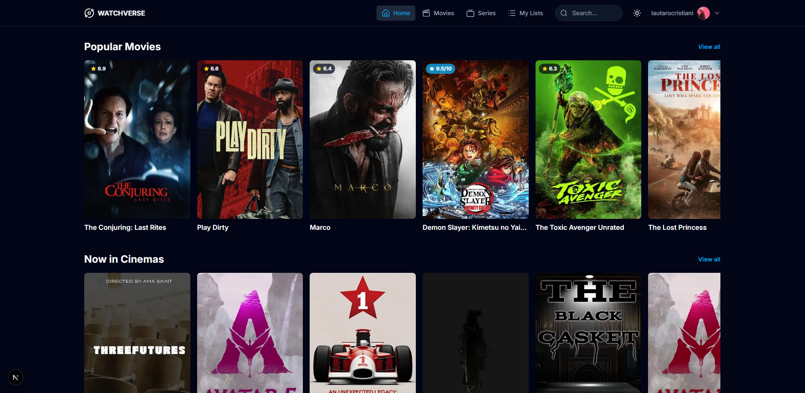

# Watchverse 🎬

Welcome to Watchverse, your personal universe for discovering, tracking, and reviewing movies and TV series. This application is built with Next.js, using the TMDB API for media data and Supabase for all user-related features.

**[Live Demo](https://YOUR_VERCEL_URL_HERE)**

---

## 🖼️ Preview

---

## ✨ Key Features

-   **Full User Authentication**: Secure sign-up, sign-in, and password reset flows powered by Supabase Auth.
-   **Movie & TV Discovery**: Browse extensive lists of popular, top-rated, and genre-specific media.
-   **Detailed Media Pages**: View trailers, synopses, cast, ratings, and similar titles.
-   **Personalized Lists**: Manage your own `Watchlist` and track your `Watched` history.
-   **Reviews and Ratings**: Rate any movie or TV show and write your own public or private reviews.
-   **Powerful Search**: Instantly search for any title across the entire TMDB database.
-   **Profile Management**: Edit your username, full name, and upload a custom avatar via Supabase Storage.
-   **Theme Switching**: Toggle between a sleek dark mode and a clean light mode.
-   **Fully Responsive**: A seamless experience on desktop, tablet, and mobile devices.

---

## 🛠️ Tech Stack

-   **Framework**: Next.js (App Router)
-   **Language**: TypeScript
-   **Styling**: Tailwind CSS
-   **Backend & Database**: Supabase (Auth, Postgres, Storage)
-   **External API**: The Movie Database (TMDB)
-   **Deployment**: Vercel

---